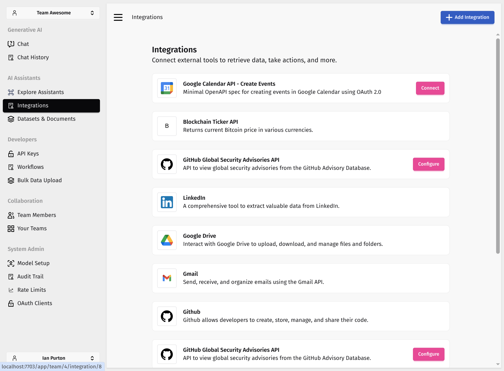

## Daisy-RSX

This is a [Dioxus](https://dioxuslabs.com/) version of the [Daisy UI](https://daisyui.com/) components.

Note: These components are used on the server side in a real project. Not sure how they would work in an SPA.

## Installation

Install **daisy_rsx** using [`cargo add`](https://doc.rust-lang.org/cargo/commands/cargo-add.html):

```bash
cargo add daisy_rsx
```

This command will add the crate to your `Cargo.toml`:

```toml
[dependencies]
daisy_rsx = "0.1"
```

For the CSS part you can compile Tailwind and DaisyUI with [tailwind-cli-extra](https://github.com/dobicinaitis/tailwind-cli-extra) which does not require `npm`.
A typical `tailwind.css` might look like:

```css
@import 'tailwindcss';
@plugin "daisyui";

@source '../web-pages/**/*.rs';
@source 'typescript/**/*.ts';
@source inline("modal modal-box modal-action");
```

The `@source inline` directives ensure all Daisy UI classes used by Daisy RSX components are included in the final CSS.

Run `tailwindcss` (or `tailwind-cli-extra`) to produce your stylesheet and you are ready to use the components in your Dioxus application.

## Examples

To see how they work in the real world, take a look at the pages in [https://github.com/bionic-gpt/bionic-gpt/tree/main/crates/web-pages](https://github.com/bionic-gpt/bionic-gpt/tree/main/crates/web-pages)



Below is an component used to build the cards in the screenshot.

```rust
#![allow(non_snake_case)]
use crate::routes::prompts::Image;
use daisy_rsx::*;
use db::queries::prompts::MyPrompt;
use dioxus::prelude::*;

#[component]
pub fn MyAssistantCard(team_id: i32, prompt: MyPrompt) -> Element {
    let description: String = prompt
        .description
        .chars()
        .filter(|&c| c != '\n' && c != '\t' && c != '\r')
        .collect();

    rsx! {
        Card {
            class: "p-3 mt-5 flex flex-row justify-between",
            div {
                class: "flex flex-row",
                // Left section: Image/Avatar
                div {
                    class: "flex flex-col content-center",
                    if let Some(object_id) = prompt.image_icon_object_id {
                        img {
                            class: "border border-neutral-content rounded p-2",
                            src: Image { team_id, id: object_id }.to_string(),
                            width: "48",
                            height: "48"
                        }
                    } else {
                        Avatar {
                            avatar_size: AvatarSize::Medium,
                            avatar_type: AvatarType::User
                        }
                    }
                    div {
                        class: "mt-2",
                        crate::assistants::visibility::VisLabel {
                            visibility: prompt.visibility
                        }
                    }
                }
                // Middle section: Info
                div {
                    class: "ml-4 text-sm flex flex-col justify-center flex-1 min-w-0",
                    h2 {
                        class: "font-semibold text-base mb-1",
                        "{prompt.name}"
                    }
                    if !description.is_empty() {
                        p {
                            class: "text-sm text-base-content/70 truncate mb-2",
                            "{description}"
                        }
                    }
                    div {
                        class: "flex items-center gap-2 text-xs text-gray-500",
                        span {
                            "Last updated "
                        }
                        RelativeTime {
                            format: RelativeTimeFormat::Relative,
                            datetime: "{prompt.updated_at}"
                        }
                    }
                }
            }

            // Right section: Action buttons
            div {
                class: "flex flex-row gap-5",
                div {
                    class: "flex flex-col justify-center text-center",
                    div {
                        class: "",
                        "{prompt.integration_count}"
                    }
                    div {
                        class: "text-base-content/70",
                        "Integration"
                        if prompt.integration_count != 1 {
                            "s"
                        }
                    }
                }
                div {
                    class: "flex flex-col justify-center text-center",
                    div {
                        class: "",
                        "{prompt.dataset_count}"
                    }
                    div {
                        class: "text-base-content/70",
                        "Dataset"
                        if prompt.dataset_count != 1 {
                            "s"
                        }
                    }
                }
                div {
                    class: "flex flex-col justify-center ml-4 gap-2",
                    DropDown {
                        direction: Direction::Bottom,
                        button_text: "...",
                        DropDownLink {
                            href: crate::routes::prompts::Edit{team_id, prompt_id: prompt.id}.to_string(),
                            "Edit"
                        }
                        DropDownLink {
                            href: crate::routes::prompts::ManageIntegrations{team_id, prompt_id: prompt.id}.to_string(),
                            "Manage Integrations"
                        }
                        DropDownLink {
                            href: crate::routes::prompts::ManageDatasets{team_id, prompt_id: prompt.id}.to_string(),
                            "Manage Datasets"
                        }
                        DropDownLink {
                            popover_target: format!("delete-trigger-{}-{}", prompt.id, team_id),
                            href: "#",
                            target: "_top",
                            "Delete"
                        }
                    }
                }
            }
        }
    }
}
```

## To Create a Release

Release publishing is handled by the GitHub Actions workflow in `.github/workflows/release.yml`. The workflow runs when a tag that starts with `v` (for example, `v0.1.48`) is pushed and will:

- Ensure the tag version matches `Cargo.toml`.
- Run the test suite.
- Publish the crate to crates.io using `secrets.CARGO_REGISTRY_TOKEN`.

A typical release flow using [`cargo-release`](https://github.com/crate-ci/cargo-release) looks like this:

```sh
cargo install cargo-release
cargo release patch
```

The command above performs a dry run. When you are ready to publish, run:

```sh
set -a
source .env
set +a
cargo release patch --execute
```

`cargo-release` will bump the version, create a matching `v*` tag, push the changes, and trigger the release workflow.
